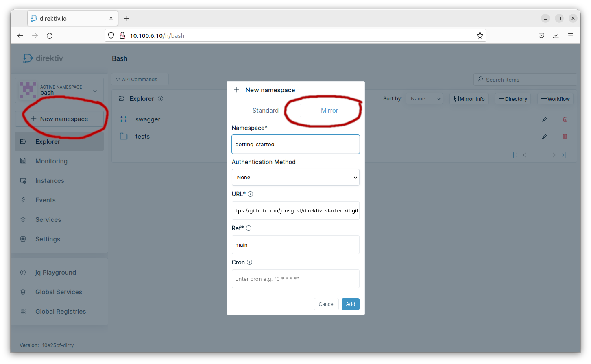
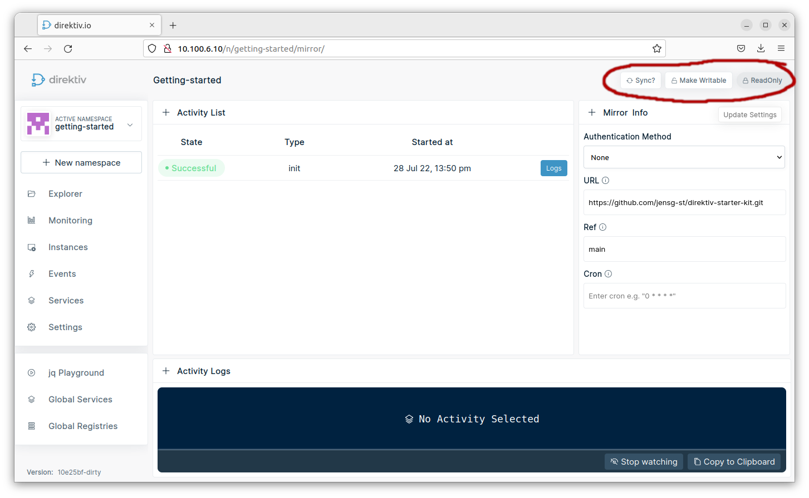

# Setup

## Create Namespace 

The first step is to create a namespace based on this [Github repository](https://github.com/jensg-st/direktiv-starter-kit). The namespace is of type "Mirror" which means it is a Git-backed namesapce. For this tutorial we are using the following values:

Name: getting-started
Authentication Method: None (It is a public repository)
URL: https://github.com/jensg-st/direktiv-starter-kit.git
Ref: main (This is the branch or tag)



## Sync and Read/Write Access

The mirror configuration can be accessed under "Mirror Info" which can be found on the first level of the linked Github folder. The sync can be initiated via a cron or manually. 


For a manual sync the directory needs to be in Read-Only mode, which means it can be updated via Git only. If it is set to "Writable" changes can be made directly without pushing new content to Git. Please be aware that the next sync will override these manual changes. This is ususally oinly used via Direktiv's CLI during development. 




# Using the CLI

For easier development Direktiv has a CLI so a flow developer does not need to use the UI to change and run flows. It is available on the [Github release page](https://github.com/direktiv/direktiv/releases/). The CLI requires a configuration file with the information of the Direktiv instance and what namespace it is handling. The name of the config file has to be `.direktiv.yaml` and a simple file could look like this:

```yaml
addr: https://MYIP
namespace: getting-started

# Optional
# if an API key is being used
api-key: MyKey

# if an auth token is being used
auth-token: my-auth-token
```

If e.g. this Git repository is for production and development on different branches or different servers the CLI supports profiles as well. It is important to add `direktiv.yaml` to `.gitignore` to avoid pushing auth tokens. 

```yaml
profiles:
- id: prod
  addr: https://MYIP
  namespace: getting-started

- id: dev
  addr: https://MYIP
  namespace: getting-started-dev

```

The CLI has two actions. The first one is `execute` which uploads the local version of the flow and executes it. If a JSON payload is required it can be added via stdin.

```sh
direktiv-sync exec folder/myworkflow.yaml

# with payload
echo '{ "my": ""data }' | direktiv-synv exec folder/myworkflow.yaml
```

The second command is the `push` command. This command updates the remote workflows with the local version but does not execute them. The push can be done for a single workflow, a folder oder recusrsively with `.`.

```sh
direktiv-sync push mywf.yaml

direktiv-sync push .
```

The CLI / Git integration has the following naming conventions: 

- All files ending with file extensions `yaml` or `yml` are considered workflows and will be pushed in recursive mode.
- If a file starts with the workflow name and an additional extension it is considered a workflow variable. If a shell script is required for a workflow `wf.yaml` an additional file `wf.yaml.myscript.sh` would create a workflow scoped variable for workflow `wf.yaml`.
- If files start with `var.` they are getting stored as namespace scoped variables, e.g. `var.icon.png`